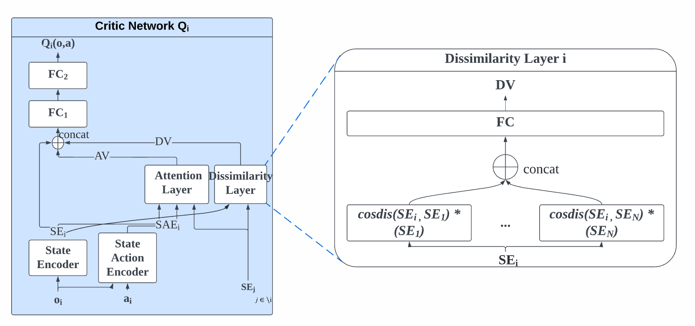
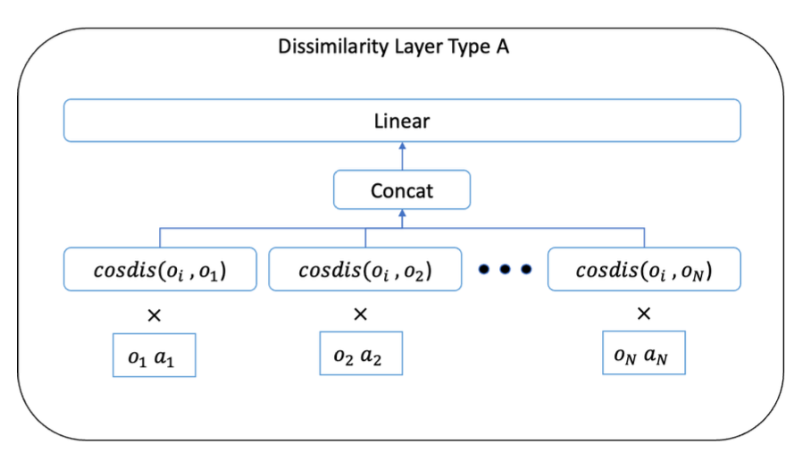
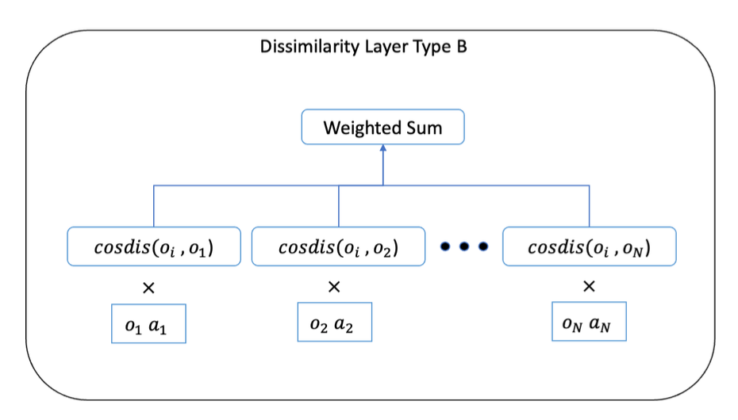
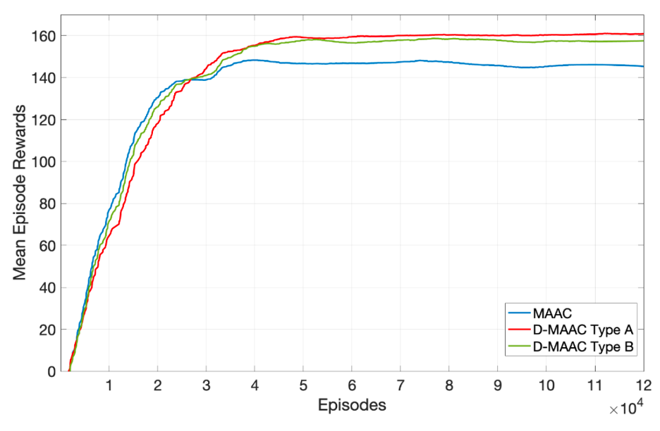

# Dissimialrity Multi-Actor-Attention-Critic

This work was presented in [IVCI 4.0 2022](https://chennai.vit.ac.in/files/ivc2022/) and will be publisehd in [LNEE Springer](https://www.springer.com/series/7818)
- Modification of Original [MAAC](https://github.com/shariqiqbal2810/MAAC) by adding Dissimialrity Layer to improve performance

- Two types of Dissimialrity Layer is introduced

- Proposed models outperform MAAC in [Cooperative treasure collections](https://github.com/shariqiqbal2810/MAAC/blob/master/envs/mpe_scenarios/fullobs_collect_treasure.py) Environment

## Requirements (from [MAAC](https://github.com/shariqiqbal2810/MAAC))
* Python 3.6.1 (Minimum)
* [OpenAI baselines](https://github.com/openai/baselines), commit hash: 98257ef8c9bd23a24a330731ae54ed086d9ce4a7
* [fork](https://github.com/shariqiqbal2810/multiagent-particle-envs) of Multi-agent Particle Environments
* [PyTorch](http://pytorch.org/), version: 0.3.0.post4 -> v1.12.1 works
* [OpenAI Gym](https://github.com/openai/gym), version: 0.9.4 -> version 0.15.7 works for me
* [Tensorboard](https://github.com/tensorflow/tensorboard), version: 0.4.0rc3 and [Tensorboard-Pytorch](https://github.com/lanpa/tensorboard-pytorch), version: 1.0 (for logging). tensorboard 2.12.2 & tensorboardX 2.6 -> works for me

